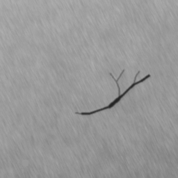
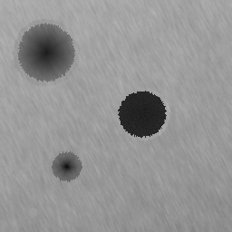
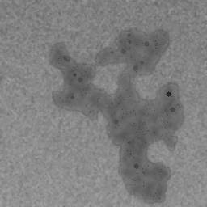
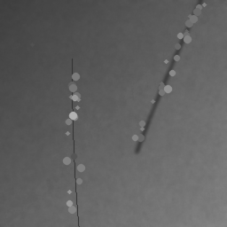

# Defect Samples

<table align="center">
<tr>
<td align="center">
<b>Crack</b>  

</td>

<td align="center">
<b>Hole</b>  

</td>

<td align="center">
<b>Normal</b>  

</td>
</tr>

<tr>
<td align="center">
<b>Rust</b>  

</td>

<td align="center">
<b>Scratch</b>  

</td>

<td align="center">
<b>Confusion Matrix</b>  

</td>
</tr>
</table>

---

The model demonstrates strong classification performance across all manufacturing defect categories with near-perfect separation between classes.
